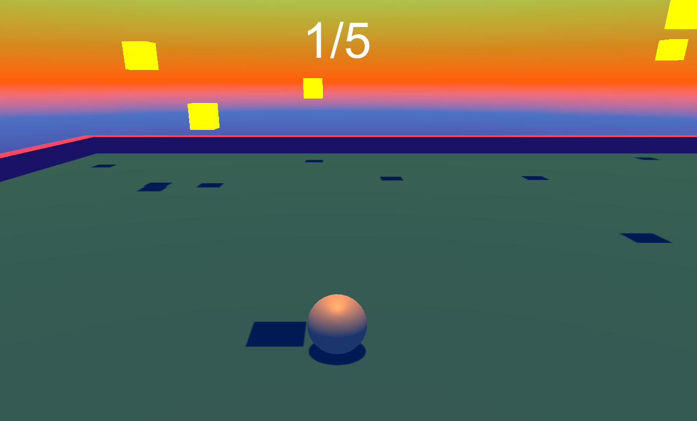

# [[ Demo Training ]]

## Description

It's a simple Unity Project done for my students to **learn the Unity basics**.

## Steps to follow

- 1 of 13: Creating the Project
- 2 of 13: Moving the Ball (PlayerController)
- 3 of 13: Moving the Camera (CameraController)
- 4 of 13: Setting up the Play Area (add borders)
- 5 of 13: Creating Collectibles (and material) 
- 6 of 13: Creating a GameManager (to instanciate collectibles & count the point)
- 7 of 13: Destroying Collectibles onCollision (Collectible script)
- 8 of 13: Displaying Score
- 9 of 13: Adding physic materials
- 10 of 13: Adding particles when destroying collectibles 
- 11 of 13: Adding music & sfx
- 12 of 13: Adding a skybox
- 13 of 13: Building the Game